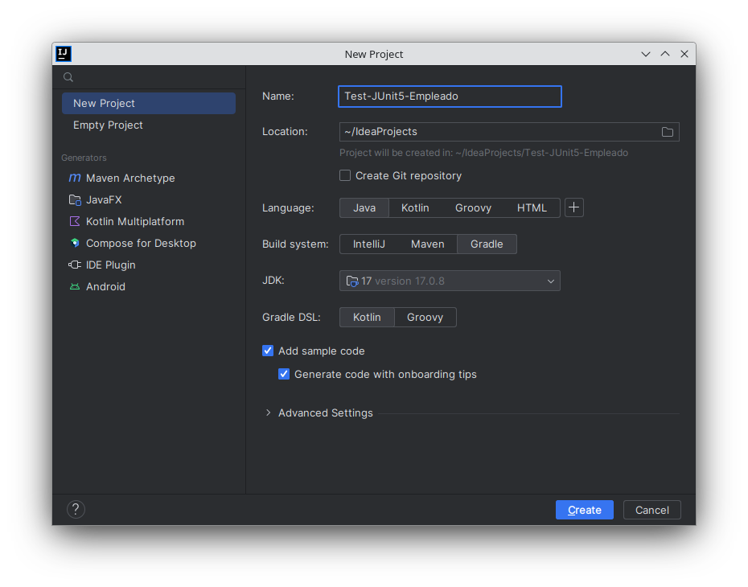

# Índice

#### [Introducción](#introduccion)
#### [Pruebas](#pruebas)
#### [Integración](#integracion)
#### [Calidad](#calidad)


<pre>
</pre>


<pre>
</pre>


# [Introducción](#indice)

1. Según tú, ¿a qué crees que nos referimos cuando hablamos de pruebas del software?
<hr>

2. Según tú, ¿qué finalidad crees que se persigue cuando se hacen pruebas de software?
<hr>

3. Según tú, ¿qué tipos de pruebas de software crees que existen?
<hr>

4. Busca una definición del término Framework. Expresa dicha definición con tus palabras.
<hr>

<pre>


</pre>

# [Pruebas](#indice)

1. ¿Qué diferencia existe entre las pruebas estáticas y dinámicas?

  Puedes consultar: https://es.wikipedia.org/wiki/Pruebas_de_software
<hr>

2. ¿Qué diferencia existe entre las pruebas de caja negra y caja blanca?

  Puedes consultar: https://es.wikipedia.org/wiki/Pruebas_de_software
<hr>

3. ¿Qué diferencia existe entre las pruebas funcionales y no funcionales?

  Puedes consultar: https://es.wikipedia.org/wiki/Pruebas_de_software
<hr>

4. Nombra al menos 4 pruebas funcionales.
<hr>

5. Nombra al menos 4 pruebas no funcionales.
<hr>

6. ¿Qué són las pruebas unitarias o pruebas de unidad?
<hr>

7. ¿Qué són las pruebas de regresión?
<hr>

8. ¿Qué son las pruebas de integración?
<hr>

9. ¿Qué son las pruebas de humo?
<hr>

10. ¿Qué son las pruebas alpha?
<hr>

11. ¿Qué son las pruebas beta?
<hr>

12. ¿Qué son las pruebas de aceptación?
<hr>

13. Instala el plugin Gradle para IntelliJ IDEA.
<hr>

14. Crea un proyecto nuevo que utilice el sistema de construcción `Gradle` y  que contenga la clase _`Empleado`_. 
<hr>

  Aquí tienes el [código fuente](https://github.com/jamj2000/Test-JUnit5-Empleado/blob/main/src/main/java/org/example/Empleado.java)




15. Edita la clase de prueba _`EmpleadoTest`_. 

  Aquí tienes el [código fuente](https://github.com/jamj2000/Test-JUnit5-Empleado/blob/main/src/test/java/org/example/EmpleadoTest.java)

  NOTA: En JUnit, el método con anotación _`@BeforeAll`_ debe ser estático y, por tanto, las variables y objetos de los que haga uso también deben serlo.
<hr>
  NOTA: El código fuente anterior está basado en el tutorial disponible en [Disco duro de roer](https://www.discoduroderoer.es/como-hacer-una-aplicacion-de-prueba-con-junit). El código original funciona con JUnit4. Ha sido modificado para hacer uso de JUnit5. 

16. Busca la tarea de Gradle para realizar los tests y ejecútalos. Puedes acceder a ellos en View -> Tools Windows -> Gradle
 


  NOTA: Existen muchas otras tareas que pueden realizarse en Gradle. Sin embargo, la tarea `run` fallará puesto que no existe método `main`.
<hr>

17. Clona el repositorio https://github.com/jamj2000/Test-JUnit5-Aritmetica en tu equipo local.
<hr>
 
18. Comprueba que en el archivo `build.gradle`  aparece la línea:

  ```gradle
  apply plugin: "jacoco"
  ```
<hr>

19. Comprueba que en el archivo `build.gradle`  aparecen también las líneas:

  ```gradle
  jacocoTestReport {
    reports {
        xml.enabled false
        csv.enabled false
        html.destination file("${buildDir}/jacocoHtml")
    }
  }
  ```
<hr>

20. Ejecuta el comando `gradle tasks` para ver las tareas disponibles.
<hr>

21. Ejecuta el comando `gradle test` para construir y pasar los tests.
<hr>

22. Ejecuta el comando `gradle jacocoTestReport` para generar informe de cobertura de código.  
  Para visualizar dicho informe ejecuta `firefox  build/jacocoHtml/index.html`.
<hr>

23. Modifica y añade los tests necesarios para que la cobertura de código sea completa.
<hr>

24. Modifica el código fuente de la clase `Utilidades.java` para solucionar los errores que aparecen y superar los tests.
<hr>


<pre>


</pre>

# [Integración](#indice)


1. ¿Indica al menos 3 servicios web de Integración Continua?
<hr>

2. En GitHub, haz un fork del repositorio https://github.com/jamj2000/DAW1-ED-Pruebas-Ejemplo1.
<hr>

3. Edita el archivo `.travis.yml` de tu repositorio bifurcado, en caso de ser necesario.
<hr>

4. Regístrate con tu cuenta de GitHub en TravisCI (https://travis-ci.org/)
<hr>

5. En TravisCI, añade tu repositorio remoto (bifurcado) para construir y realizar los tests en dicho sitio web. 
<hr>

6. En TravisCI, haz click en el ___badge___ o insignia que aparece en la parte superior derecha, y copia el código en formato Markdown.
<hr>

7. En GitHub, en tu repositorio bifurcado, copia el código Markdown anterior en el archivo README.md.
<hr>

8. [__Opcional. Vale por 1 pto en la nota de esta Unidad__]  
  En una plataforma Linux (preferiblemente Ubuntu), realiza la instalación de un servicio de Integración Continua basado en Jenkins.   
  Explica los pasos seguidos y elabora un documento PDF donde quede reflejado todo el proceso y las pruebas que has realizado.

  Deberas seguir los pasos indicados en el enlace de instrucciones que aparece a continuación.  
  INSTRUCCIONES: https://yeiei.net/es/como-construir-un-entorno-de-integracion-continua-con-jenkins-y-docker/
<hr>


<pre>


</pre>


# [Calidad](#indice)


1. ¿Qué significan las siglas QA y QC? ¿Qué diferencia existe entre ellas?
<hr>

2. Explica brevemente cada uno de los factores de calidad que aparecen en las diapositivas.
<hr>


<pre>


</pre>
